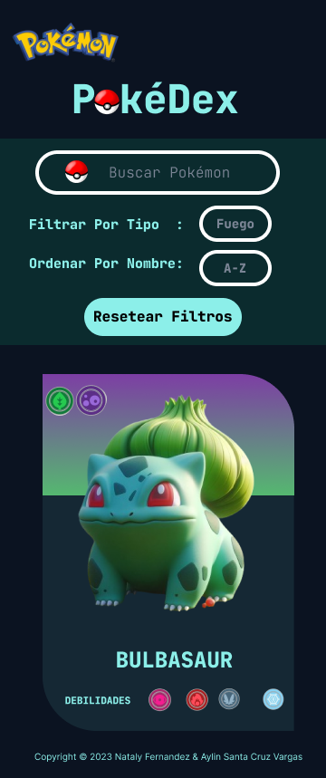
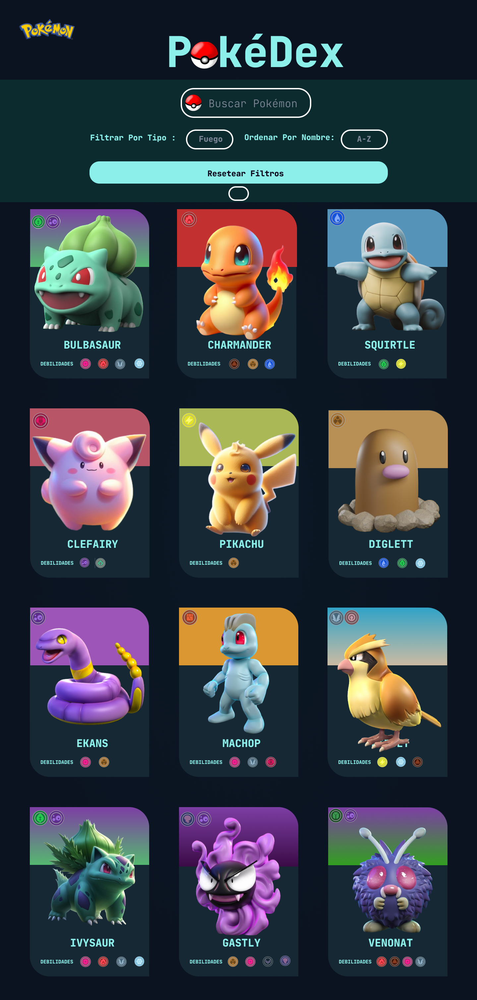

<h1 style="text-align:center">PkéDex</h1>

### 1. Definición del producto

En este proyecto **se contruyó una _página web de pokemones_ para visualizar un
_conjunto (set) de datos_** generado con [ChatGPT](https://openai.com/chatgpt).

La página web permite **visualizar la data,
filtrarla, ordenarla y calcular estadística por tipo de pokemon** y realizar la busqueda de algun
pokemon en particular. La interfaz es sencilla haciendo que el uso de la aplicación sea intuitiva
y fácil de usar.

***

## 2. Funcionalidades

**visualizar la data, filtrarla, ordenarla y calcular alguna estadística**.

[ x ] Las funcionalidades de ordenar deben operar sobre la data filtrada.
Por ejemplo, si filtro los pokemones de tipo fuego y luego los ordeno por
nombre ascendentemente, la aplicación deberá mantener el filtro aplicado y
ordenar los pokemones de tipo fuego.

[ x ] La aplicación debe permitir a la usuaria reiniciar la aplicación, limpiando
filtros y ordenamiento, con un `<button>` con un atributo de datos
`data-testid="button-clear"`.

[ x ] Las operaciones de filtrar, ordenar, limpiar, etc. no deben recargar
la página, si no que deben agregar el contenido en una manera
dinámica via javascript.

[ x ] La aplicación será _responsive_, es decir, debe visualizarse sin problemas
desde distintos tamaños de pantallas: móviles, tablets y desktops.


<p style="text-align:center">

</p>
***

## 3. Criterios de aceptación mínimos del proyecto

### Criterios de código

#### HTML

- **Uso de HTML semántico**

  - [ x ] Tiene un `<header>` con `<h1>`
  - [ x ] Tiene un `<footer>`
  - [ x ] Tiene un `<main>` con `<h2>`
  - [ x ] Todas las etiquetas de controles (inputs, selects, radio, etc) tienen `<label>`
  - [ x ] `<ul>` esta usado para dibujar la data
  - [ x ] Los hijos de `<li>` usan attributos de microdata `itemscope` e `itemprop`

#### CSS

- **Uso de selectores de CSS**

  - [ x ] Uso de selector class para los items <li>
  - [ x ] Uso de flexbox en sentido `row` y `column`
  - [ x ] Uso de flexbox para el elemento que contiene los items
  - [ x ] Uso de flexbox para el elemento que contiene los UI inputs

#### Web APIs

- **Uso de selectores del DOM**

  - [ x ] La aplicación usa [`querySelector`](https://developer.mozilla.org/en-US/docs/Web/API/Document/querySelector)
    para buscar los elementos del DOM

- **Manejo de eventos del DOM (listeners, propagación, delegación)**

  - [ x ] `addEventListener` con callback que tiene parámetro de `event`,
    lo que permite el uso del objeto [`event`](https://developer.mozilla.org/en-US/docs/Learn/JavaScript/Building_blocks/Events#event_objects)
    con `event.target` o `event.currentTarget`
  - [ x ] La aplicación registra [Event Listeners](https://developer.mozilla.org/en/docs/Web/API/EventTarget/addEventListener)
    para escuchar `click`, `change`, `keyup` dependiendo del evento que
    se quiere escuchar

- **Manipulación dinámica del DOM**

  - [ x ] La aplicación actualiza el atributo [`innerHTML`](https://developer.mozilla.org/es/docs/Web/API/Element/innerHTML).
  - [ x ] La aplicación usa `createElement` y `appendChild`, o template strings
    para crear elementos

#### JavaScript

- **Variables (declaración, asignación, ámbito)**

  - [ x ] La aplicación declara variables con [`let`](https://developer.mozilla.org/en-US/docs/Web/JavaScript/Reference/Statements/let)
    y [`const`](https://developer.mozilla.org/en-US/docs/Web/JavaScript/Reference/Statements/const)
    en manera adecuada

- **Uso de condicionales (if-else, switch, operador ternario, lógica booleana)**

  - [ x ] La aplicación usa el statement
    [`if..else`](https://developer.mozilla.org/en-US/docs/Web/JavaScript/Reference/Statements/if...else)
    para evaluar condiciones

- **Uso de bucles/ciclos (while, for, for..of)**

  - [ x ] La aplicación usa el statement [`for`](https://developer.mozilla.org/en-US/docs/Web/JavaScript/Reference/Statements/for)
    o método [`forEach`](https://developer.mozilla.org/en-US/docs/Web/JavaScript/Reference/Global_Objects/Array/forEach)
    para iterar

- **Funciones (params, args, return)**

  En el archivo `dataFunctions.js` define las siguientes funciones:

  - [ x ] una función `sortBy` que tiene 3 parámetros (`data`, `sortBy`, `sortOrder`)
    y devuelve el arreglo ordenado
  - [ x ] una función `filterBy` que tiene 3 parámetros (`data`, `filterBy`, `value`)
    y devuelve el arreglo filtrado
  - [ x ] una función `computeStats` que tiene al menos un parámetro (`data`)
    y devuelve un valor computado

  Más sobre estos puntos en [la sección dataFunctions.js](#src/dataFunctions.js)

- **Arrays (arreglos)**

  - [ x ] Uso de [Arreglos](https://curriculum.laboratoria.la/es/topics/javascript/04-arrays)
  - [ x ] Uso de [Array.prototype.sort() - MDN](https://developer.mozilla.org/es/docs/Web/JavaScript/Reference/Global_Objects/Array/sort)
    o [Array.prototype.toSorted - MDN](https://developer.mozilla.org/es/docs/Web/JavaScript/Reference/Global_Objects/Array/toSorted)
  - [ x ] Uso de [Array.prototype.forEach() - MDN](https://developer.mozilla.org/es/docs/Web/JavaScript/Reference/Global_Objects/Array/forEach)
  - [ x ] Uso de [Array.prototype.map() - MDN](https://developer.mozilla.org/es/docs/Web/JavaScript/Reference/Global_Objects/Array/map)
  - [ x ] Uso de [Array.prototype.filter() - MDN](https://developer.mozilla.org/es/docs/Web/JavaScript/Reference/Global_Objects/Array/filter)
  - [ ] Uso de [Array.prototype.reduce() - MDN](https://developer.mozilla.org/es/docs/Web/JavaScript/Reference/Global_Objects/Array/Reduce)

- **Objetos**

  - [ x ] Uso de notación de punto para [acceder propiedades](https://developer.mozilla.org/en-US/docs/Web/JavaScript/Reference/Operators/Property_accessors)
  - [ x ] Uso de notación de brackets para [acceder propiedades](https://developer.mozilla.org/en-US/docs/Web/JavaScript/Reference/Operators/Property_accessors)

- **Módulos de ECMAScript (ES Modules)**

  - [ x ] La aplicación usa [`import`](https://developer.mozilla.org/en-US/docs/Web/JavaScript/Reference/Statements/import)
    y [`export`](https://developer.mozilla.org/en-US/docs/Web/JavaScript/Reference/Statements/export)
    para importar y exportar valores desde un modulo JavaScript.

***
## 4.Generar los datos

La estructura de cada objeto de nuestro data es la siguiente:

- `id`: Identificador único, el id es un string de no más de 32 characteres, en minúscula, compuesto solo
  por letras, números, underscore (`_`) o guión (`-`).
- `name`: El nombre de los pokemones.
- `type`: Un objeto que tiene 2 propiedades `typeName` y `typeImage`. `typeName` -> muestra un a
  un arreglo con los nombres de los tipos de pokemon, `typeImage`-> muestra un array de las imagenes de los tipos de pokemones.
- `image`: URL de la imagen del pokemon.
- `weaknesses`: Un objeto que tiene 2 propiedades `weaknessesName` y `weaknessesImage`.
  `weaknessesName` -> muestra un arreglo con los nombres de las debilidades de los pokemones, `weaknessesImage`-> muestra un array de las imagenes de las debilidades de los pokemones.
- `baseStats`: Un objeto con al menos **4** , en
  formato `"nombre": "valor"`, por ejemplo:

  ```json
  "baseStats": {
    "hp": "40",
    "attack": "80",
    "defense": "35",
    "speed": "70",
  }
  ```

- `height`: La altura del pokemón.
- `category`: La categoria del pokemón.
- `ability`: La abilidad del pokemón.
- `weight`: El peso del pokemón.

  Los _valores de las propiedades_, son tipo `number`, `boolean`
  o un `string`, `objeto` y `array`.

La data final de nuestro proyecto, según los requisitos anteriores es la siguiente:

```js
export default [
  {
    id: "6",
    name: "Charizard",
    type: {
      typeName: ["Fire", "Flying"],
      typeImage: ["./assets/fuego.png", "./assets/volador.png"],
    },
    image: "./assets/Charizard.png",
    weaknesses: {
      weaknessesName: ["Water", "Electric", "Rock"],
      weaknessesImage: [
        "./assets/agua.png",
        "./assets/electrico.png",
        "./assets/roca.png",
      ],
    },
    baseStats: {
      hp: "78",
      attack: "84",
      defense: "78",
      speed: "100",
    },
    height: "1.7",
    category: "Flame",
    ability: "Blaze",
    weight: "90.5",
  },
  //... 23 objetos más
];
```
***
## 5. Prompt utilizado
***
## 6. Diseño de la Interfaz de Usuaria

### Prototipo de alta fidelidad

> Prototipo Móvil

<p align="center">

</p>

> Prototipo Web


<p align="center">

</p>


[Figma](https://www.figma.com/file/twg4MrXgEyAfpr7BHI7aYH/Data-Pokemon?type=design&node-id=0-1&mode=design&t=xSH2aC8qhrQSdYBp-0)

***
## 7. Objetivos de aprendizaje

Reflexiona y luego marca los objetivos que has llegado a entender y aplicar en tu proyecto. Piensa en eso al decidir tu estrategia de trabajo.

### HTML

- [ x ] **Uso de HTML semántico**

    <details><summary>Links</summary><p>

  - [HTML semántico](https://curriculum.laboratoria.la/es/topics/html/html5/semantic-html)
  - [Semantics - MDN Web Docs Glossary](https://developer.mozilla.org/en-US/docs/Glossary/Semantics#Semantics_in_HTML)
  </p></details>

### CSS

- [ x ] **Uso de selectores de CSS**

    <details><summary>Links</summary><p>

  - [Intro a CSS](https://curriculum.laboratoria.la/es/topics/css/css/intro-css)
  - [CSS Selectors - MDN](https://developer.mozilla.org/es/docs/Web/CSS/CSS_Selectors)
  </p></details>

- [ x ] **Modelo de caja (box model): borde, margen, padding**

    <details><summary>Links</summary><p>

  - [Box Model & Display](https://curriculum.laboratoria.la/es/topics/css/css/boxmodel-and-display)
  - [The box model - MDN](https://developer.mozilla.org/en-US/docs/Learn/CSS/Building_blocks/The_box_model)
  - [Introduction to the CSS box model - MDN](https://developer.mozilla.org/en-US/docs/Web/CSS/CSS_Box_Model/Introduction_to_the_CSS_box_model)
  - [CSS display - MDN](https://developer.mozilla.org/pt-BR/docs/Web/CSS/display)
  - [display - CSS Tricks](https://css-tricks.com/almanac/properties/d/display/)
  </p></details>

- [ x ] **Uso de flexbox en CSS**

    <details><summary>Links</summary><p>

  - [A Complete Guide to Flexbox - CSS Tricks](https://css-tricks.com/snippets/css/a-guide-to-flexbox/)
  - [Flexbox Froggy](https://flexboxfroggy.com/#es)
  - [Flexbox - MDN](https://developer.mozilla.org/en-US/docs/Learn/CSS/CSS_layout/Flexbox)
  </p></details>

### Web APIs

- [ x ] **Uso de selectores del DOM**

    <details><summary>Links</summary><p>

  - [Manipulación del DOM](https://curriculum.laboratoria.la/es/topics/browser/dom/1-dom-methods-selection)
  - [Introducción al DOM - MDN](https://developer.mozilla.org/es/docs/Web/API/Document_Object_Model/Introduction)
  - [Localizando elementos DOM usando selectores - MDN](https://developer.mozilla.org/es/docs/Web/API/Document_object_model/Locating_DOM_elements_using_selectors)
  </p></details>

- [ x ] **Manejo de eventos del DOM (listeners, propagación, delegación)**

    <details><summary>Links</summary><p>

  - [Introducción a eventos - MDN](https://developer.mozilla.org/es/docs/Learn/JavaScript/Building_blocks/Events)
  - [EventTarget.addEventListener() - MDN](https://developer.mozilla.org/es/docs/Web/API/EventTarget/addEventListener)
  - [EventTarget.removeEventListener() - MDN](https://developer.mozilla.org/es/docs/Web/API/EventTarget/removeEventListener)
  - [El objeto Event](https://developer.mozilla.org/es/docs/Web/API/Event)
  </p></details>

- [ x ] **Manipulación dinámica del DOM**

    <details><summary>Links</summary><p>

  - [Introducción al DOM](https://developer.mozilla.org/es/docs/Web/API/Document_Object_Model/Introduction)
  - [Node.appendChild() - MDN](https://developer.mozilla.org/es/docs/Web/API/Node/appendChild)
  - [Document.createElement() - MDN](https://developer.mozilla.org/es/docs/Web/API/Document/createElement)
  - [Document.createTextNode()](https://developer.mozilla.org/es/docs/Web/API/Document/createTextNode)
  - [Element.innerHTML - MDN](https://developer.mozilla.org/es/docs/Web/API/Element/innerHTML)
  - [Node.textContent - MDN](https://developer.mozilla.org/es/docs/Web/API/Node/textContent)
  </p></details>

### JavaScript

- [ x ] **Diferenciar entre tipos de datos primitivos y no primitivos**

- [ x ] **Arrays (arreglos)**

    <details><summary>Links</summary><p>

  - [Arreglos](https://curriculum.laboratoria.la/es/topics/javascript/arrays)
  - [Array - MDN](https://developer.mozilla.org/es/docs/Web/JavaScript/Reference/Global_Objects/Array/)
  - [Array.prototype.sort() - MDN](https://developer.mozilla.org/es/docs/Web/JavaScript/Reference/Global_Objects/Array/sort)
  - [Array.prototype.forEach() - MDN](https://developer.mozilla.org/es/docs/Web/JavaScript/Reference/Global_Objects/Array/forEach)
  - [Array.prototype.map() - MDN](https://developer.mozilla.org/es/docs/Web/JavaScript/Reference/Global_Objects/Array/map)
  - [Array.prototype.filter() - MDN](https://developer.mozilla.org/es/docs/Web/JavaScript/Reference/Global_Objects/Array/filter)
  - [Array.prototype.reduce() - MDN](https://developer.mozilla.org/es/docs/Web/JavaScript/Reference/Global_Objects/Array/Reduce)
  </p></details>

- [ x ] **Objetos (key, value)**

    <details><summary>Links</summary><p>

  - [Objetos en JavaScript](https://curriculum.laboratoria.la/es/topics/javascript/objects/objects)
  </p></details>

- [ x ] **Variables (declaración, asignación, ámbito)**

    <details><summary>Links</summary><p>

  - [Valores, tipos de datos y operadores](https://curriculum.laboratoria.la/es/topics/javascript/basics/values-variables-and-types)
  - [Variables](https://curriculum.laboratoria.la/es/topics/javascript/basics/variables)
  </p></details>

- [ x ] **Uso de condicionales (if-else, switch, operador ternario, lógica booleana)**

    <details><summary>Links</summary><p>

  - [Estructuras condicionales y repetitivas](https://curriculum.laboratoria.la/es/topics/javascript/flow-control/conditionals-and-loops)
  - [Tomando decisiones en tu código — condicionales - MDN](https://developer.mozilla.org/es/docs/Learn/JavaScript/Building_blocks/conditionals)
  </p></details>

- [ x ] **Uso de bucles/ciclos (while, for, for..of)**

    <details><summary>Links</summary><p>

  - [Bucles (Loops)](https://curriculum.laboratoria.la/es/topics/javascript/flow-control/loops)
  - [Bucles e iteración - MDN](https://developer.mozilla.org/es/docs/Web/JavaScript/Guide/Loops_and_iteration)
  </p></details>

- [ x ] **Funciones (params, args, return)**

    <details><summary>Links</summary><p>

  - [Funciones (control de flujo)](https://curriculum.laboratoria.la/es/topics/javascript/flow-control/functions)
  - [Funciones clásicas](https://curriculum.laboratoria.la/es/topics/javascript/functions/classic)
  - [Arrow Functions](https://curriculum.laboratoria.la/es/topics/javascript/functions/arrow)
  - [Funciones — bloques de código reutilizables - MDN](https://developer.mozilla.org/es/docs/Learn/JavaScript/Building_blocks/Functions)
  </p></details>

- [ ] **Pruebas unitarias (unit tests)**

    <details><summary>Links</summary><p>

  - [Empezando con Jest - Documentación oficial](https://jestjs.io/docs/es-ES/getting-started)
  </p></details>

- [ x ] **Módulos de ECMAScript (ES Modules)**

    <details><summary>Links</summary><p>

  - [import - MDN](https://developer.mozilla.org/es/docs/Web/JavaScript/Reference/Statements/import)
  - [export - MDN](https://developer.mozilla.org/es/docs/Web/JavaScript/Reference/Statements/export)
  </p></details>

- [ x ] **Uso de linter (ESLINT)**

- [ x ] **Uso de identificadores descriptivos (Nomenclatura y Semántica)**

- [ x ] **Diferenciar entre expresiones (expressions) y sentencias (statements)**

### Control de Versiones (Git y GitHub)

- [ x ] **Git: Instalación y configuración**

- [ x ] **Git: Control de versiones con git (init, clone, add, commit, status, push, pull, remote)**

- [ x ] **Git: Integración de cambios entre ramas (branch, checkout, fetch, merge, reset, rebase, tag)**

- [ x ] **GitHub: Creación de cuenta y repos, configuración de llaves SSH**

- [ ] **GitHub: Despliegue con GitHub Pages**

    <details><summary>Links</summary><p>

  - [Sitio oficial de GitHub Pages](https://pages.github.com/)
  </p></details>

- [ x ] **GitHub: Colaboración en Github (branches | forks | pull requests | code review | tags)**

### Centrado en el usuario

- [ x ] **Diseñar y desarrollar un producto o servicio poniendo a las usuarias en el centro**

### Diseño de producto

- [ x ] **Crear prototipos de alta fidelidad que incluyan interacciones**

- [ x ] **Seguir los principios básicos de diseño visual**

### Investigación

- [ x ] **Planear y ejecutar testeos de usabilidad de prototipos en distintos niveles de fidelidad**

    <details><summary>Links</summary><p>

  - [Intro a testeos usabilidad](https://coda.io/@bootcamp-laboratoria/contenido-ux/test-de-usabilidad-15)
  - [Pruebas con Usuarios 1 — ¿Qué, cuándo y para qué testeamos?](https://eugeniacasabona.medium.com/pruebas-con-usuarios-1-qu%C3%A9-cu%C3%A1ndo-y-para-qu%C3%A9-testeamos-7c3a89b4b5e7)
  </p></details>

### AI Prompting

- [ x ] **Dando Instrucciones**

    <details><summary>Links</summary><p>

  - [Dando Instrucciones | Learn Prompting: Your Guide to Communicating with AI](https://learnprompting.org/es/docs/basics/instructions)
  </p></details>

- [ x ] **Few shot prompting**

    <details><summary>Links</summary><p>

  - [Few shot prompting | Learn Prompting: Your Guide to Communicating with AI](https://learnprompting.org/es/docs/basics/few_shot)
  </p></details>
***
## 8. Herramientas

- [Git](https://git-scm.com/)
- [GitHub](https://github.com/)
- [GitHub Pages](https://pages.github.com/)
- [Mozilla]
  - [https://developer.mozilla.org/es/docs/Web/JavaScript/Reference/Global_Objects/Array/forEach]
  - [https://developer.mozilla.org/es/docs/Web/JavaScript/Reference/Global_Objects/Array/map]
  - [https://developer.mozilla.org/es/docs/Web/JavaScript/Reference/Global_Objects/Array/reduce]
  - [https://developer.mozilla.org/es/docs/Web/JavaScript/Reference/Global_Objects/Array/sort]
- [Trello][https://trello.com/b/iP4j4Jfu/dataverse-pokemones]
- [Figma][https://www.figma.com/file/twg4MrXgEyAfpr7BHI7aYH/Data-Pokemon?type=design&node-id=0-1&mode=design&t=xSH2aC8qhrQSdYBp-0]
- [Node.js](https://nodejs.org/)
- [Jest](https://jestjs.io/)
- [Chart][https://www.chartjs.org/docs/latest/]
